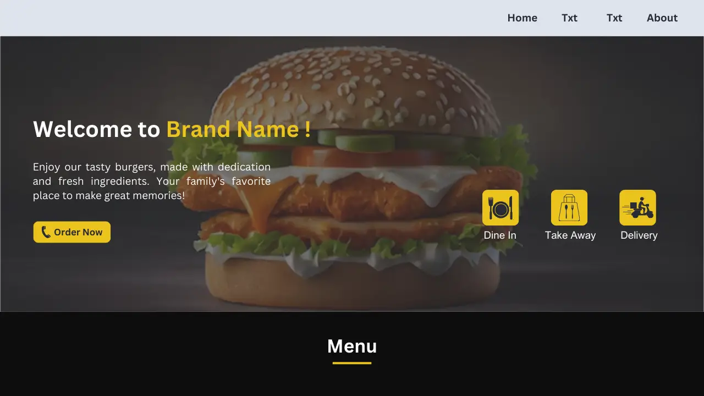

<h1>Restaurant Website</h1>

Welcome to the Restaurant Website Development project! This repository contains the codebase for a fully responsive and aesthetically pleasing restaurant website built using HTML, CSS, and Bootstrap. The project aims to provide a professional online presence for restaurants, featuring essential components like menus, reservation forms, gallery, and contact information.

<h2>Features</h2>
<ul>
  <li align="justify"><b>Responsive Design: </b>Ensures the website looks great on all devices, from desktops to mobile phones.</li>
  <li align="justify"><b>Elegant UI: </b>Utilizes Bootstrap for a modern and clean design.Utilizes Bootstrap for a modern and clean design.</li>
  <li align="justify"><b>Navigation Bar </b>Smooth scrolling and easy-to-use navigation for a seamless user experience.</li>
  <li align="justify"><b>Menu Section: </b>Beautifully designed menu layout to showcase the restaurant's offerings.</li>
  <li align="justify"><b>Gallery: </b>Stunning image gallery to highlight the restaurant's ambiance and dishes.</li>
  <li align="justify"><b>Contact Information: </b>Clearly displayed contact details with a functional contact form.</li>
  <li align="justify"><b>Footer: </b>Contains social media links and additional information about the restaurant. </li>
</ul>

<h2>Technologies Used</h2>

<ul>
  <li align="justify"><b>HTML5: </b>For structuring the content on the web.</li>
  <li align="justify"><b>CSS3: </b>For styling and enhancing the appearance of the website.</li>
  <li align="justify"><b>Bootstrap 4: </b>For responsive layout and pre-designed components.</li>
</ul>

  
<h4 align="center"> Restaurant Website | Created by <a href="https://askaf.in/" target="_blank">Askaf</a></h4>
